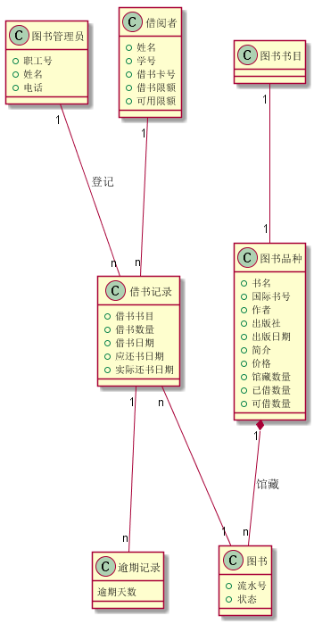
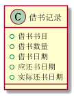

# 实验3：业务流程建模（老师示范）
|学号|班级|姓名|照片|
|:-------:|:-------------: | :----------:|:---:|
|201510414119|软件(本)15-1|汪俊程||
## 1. 图书管理系统的类图

### 1.1 类图PlantUML源码如下：

``` class
@startuml
class 图书管理员{
    +职工号
    +姓名
    +电话
}

class 图书书目{

}

class 图书{
    +流水号
    +状态
}

class 图书品种{
    +书名
    +国际书号
    +作者
    +出版社
    +出版日期
    +简介
    +价格
    +馆藏数量
    +已借数量
    +可借数量
}

class 借阅者{
    +姓名
    +学号
    +借书卡号
    +借书限额
    +可用限额
}

class 借书记录{
    +借书书目
    +借书数量
    +借书日期
    +应还书日期
    +实际还书日期
}

class 逾期记录{
    逾期天数
}

图书书目"1"---"1"图书品种
图书品种"1"*---"n"图书:馆藏
借书记录"n"---"1"图书
图书管理员"1"---"n"借书记录:登记
借阅者"1"---"n"借书记录
借书记录"1"---"n"逾期记录
@enduml
``` 
#### 对象图如下：


## 2. 图书管理系统的对象图
### 2.1 图书品种类的对象图
#### 源码如下：
``` class
@startuml
class 图书品种{
    +书名
    +国际书号
    +作者
    +出版社
    +出版日期
    +简介
    +价格
    +馆藏数量
    +已借数量
    +可借数量
}
@enduml
``` 
#### 对象图如下：


#### 说明：
``` 
图书品种类：   
    书名
    国际书号
    作者
    出版社
    出版日期
    简介
    价格
    馆藏数量
    已借数量
    可借数量

``` 
### 2.2 借阅者类的对象图
#### 源码如下：
``` class
class 借阅者{
    +姓名
    +学号
    +借书卡号
    +借书限额
    +可用限额
}

``` 
#### 对象图如下：


#### 说明：
``` 
借阅者类：
    姓名
    学号
    借书卡号
    借书限额
    可用限额
``` 
### 2.3 借书记录类的对象图
#### 源码如下：
``` class
@startuml
class 借书记录{
    +借书书目
    +借书数量
    +借书日期
    +应还书日期
    +实际还书日期
}

@enduml
``` 
#### 对象图如下：


#### 说明：
