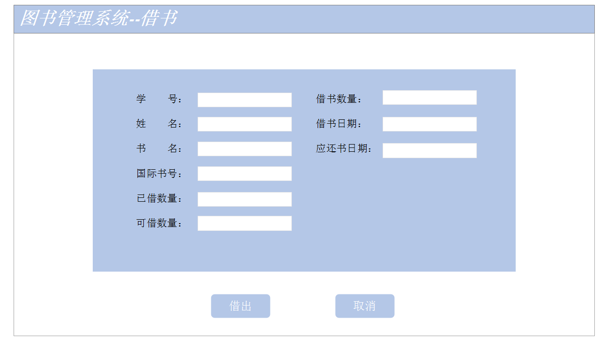

# 实验5：图书管理系统数据库设计与界面设计
|学号|班级|姓名|照片|
|:-------:|:-------------: | :----------:|:---:|
|201510414119|软件(本)15-1|汪俊程||

## 1.数据库表设计

## 1.1. 图书品种类表
|字段|类型|主键，外键|可以为空|默认值|约束|说明|
|:-------:|:-------------:|:------:|:----:|:---:|:----:|:-----|
|国际书号|varchar(50)|主键|否||||
|书名|varchar(50)| |否||||
|作者|varchar(50)| |否||||
|出版社|varchar(200)| |否||||
|价格|double| |否||||
|出版日期|varchar(50)| |否||||
|简介|varchar(50)| |否||||
|馆藏数量|double| |否||||
|已借数量|double| |否||||
|可借数量|double| |否||||


## 1.2. 图书表
|字段|类型|主键，外键|可以为空|默认值|约束|说明|
|:-------:|:-------------:|:------:|:----:|:---:|:----:|:-----|
|流水号|varchar(50)|主键|否||||
|状态|varchar(50)| |否||||


## 1.3. 借阅者信息表
|字段|类型|主键，外键|可以为空|默认值|约束|说明|
|:-------:|:-------------:|:------:|:----:|:---:|:----:|:-----|
|学号|varchar(50)|主键|否||||
|姓名|varchar(50)| |否||||
|借书卡号|int| |否||||
|借书限额|int| |否||||
|可借限额|int| |是||||

## 1.4. 管理员信息表
|字段|类型|主键，外键|可以为空|默认值|约束|说明|
|:-------:|:-------------:|:------:|:----:|:---:|:----:|:-----|
|职工号|varchar(50)|主键|否||||
|姓名|varchar(50)| |否||||
|电话|int| |否||||

## 1.5. 借阅记录类表
|字段|类型|主键，外键|可以为空|默认值|约束|说明|
|:-------:|:-------------:|:------:|:----:|:---:|:----:|:-----|
|借书数目|int|主键 |否||||
|借书数量|int|外键|否||||
|借书日期|Datetime| |否||||
|应还书日期|Datetime| |否||||
|实际还书日期|Datetime| |否||||


***

## 2. 界面设计
## 2.1. 借书界面设计

- 用例图参见：借书用例
- 类图参见：借书类，读者类
- 顺序图参见：借书顺序图
- API接口如下：

1. 借阅者API

- 功能：获取用户基本信息
- 请求地址： http://localhost:8080/borrowbook/
- 请求方法：GET
- 请求参数：

|参数名称|必填|说明|
|:-------:|:-------------: | :----------:|
|ID|是|借阅者的uid|
|access_roken|是|用于验证请求合法性的认证信息。 |
|method|是|固定为 “GET”。|

- 返回示例：
```
{
  "data": [
        {
            "uid": "201510414119",
            "nickname": "汪俊程",
            
          
        }
    ],
    "code": 200
}
```
- 返回参数说明：
    
|参数名称|说明|
|:-------:|:-------------: |
|data|用户的个人基本信息|
|code|返回码|

2. 验证API
- 功能：用于验证借阅者id是否存在
- 请求地址： http://localhost:8080/borrowbook/
- 请求方法：POST
- 请求参数：

|参数名称|必填|说明|
|:-------:|:-------------: | :----------:|
|ID|是|借阅者的uid|
|action|是|固定为 “checkID”。|
|access_token|是|用于验证请求合法性的认证信息。 |
|method|是|固定为 “GET”。|

- 返回实例：
```
{
    "info":"验证成功",
    "code":200
}
```
- 返回参数说明：
    
|参数名称|说明|
|:-------:|:-------------: |
|Info|返回信息|
|code|返回码|


 
