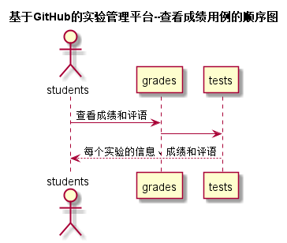

# “查看成绩”用例 [返回](../../README.md)
## 1. 用例规约

|用例名称|查看成绩|
|-------|:-------------|
|功能|学生查看指定课程实验任务的信息|
|参与者|学生|
|前置条件| 登录成功，能访问该课程|
|后置条件||
|主事件流| 1. 用户点击查看实验成绩及评价按钮 2.系统根据课程号以及学号查询并返回实验成绩信息 |
|备选事件流|如果作业为批改则没有成绩显示|

## 2. 业务流程（顺序图） [源码](../查看成绩.puml)
 

## 3. 界面设计
- 界面参照: 
- API接口调用
    - 接口1：[查看成绩](../jiekou/查看成绩.md) 

## 4. 算法描述
    无
    
## 5. 参照表
- [STUDENTS](../../数据库设计.md/#STUDENTS)
- [score](../../数据库设计.md/#GRADES)

