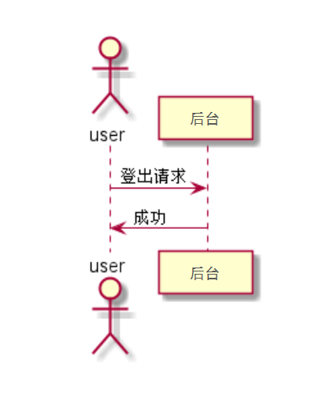

# “退出”用例 [返回](../../README.md)

## 1. 用例规约

|用例名称|退出|
|-------|:-------------|
|功能|退出平台|
|参与者|访客|
|前置条件| |
|后置条件|退出页面|
|主事件流| 点击退出登录按钮，然后退出登录|
|备选事件流| |

## 2. 业务流程（顺序图） [源码](../退出.puml)
 

## 3. 界面设计
- 界面参照: 
- API接口调用
    - 接口：[logout](../jiekou/logout.md)
    
## 4. 算法描述 [源码](../退出2.puml)

    
## 5. 参照表

- [USERS](../../数据库设计.md/#USERS)
