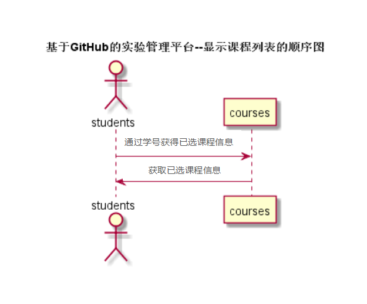

# “课程列表”用例 [返回](../../README.md)
## 1. 用例规约
|用例名称|显示课程列表|
|-------|:-------------|
|功能|根据学期和专业显示学生的课程列表|
|参与者|学生|
|前置条件| 以学生的身份登录成功|
|后置条件|所选学期存在所修课程|
|主事件流| 1. 学生选择所修学期 2.系统根据学期名称和学生所在专业查询课程列表 3.返回符合条件的课程列表 |
|备选事件流| |

## 2. 业务流程（顺序图） [源码](../选课查询.puml)
 

## 3. 界面设计
- 界面参照: 
- 接口：[选课查询](../jiekou/选课查询.md)

## 4. 算法描述（活动图）

## 5. 参照表
- [STUDENTS](../../数据库设计.md/#STUDENTS)
- [TEACHERS](../../数据库设计.md/#TEACHERS)
- [COURSES](../../数据库设计.md/#COURSES)

